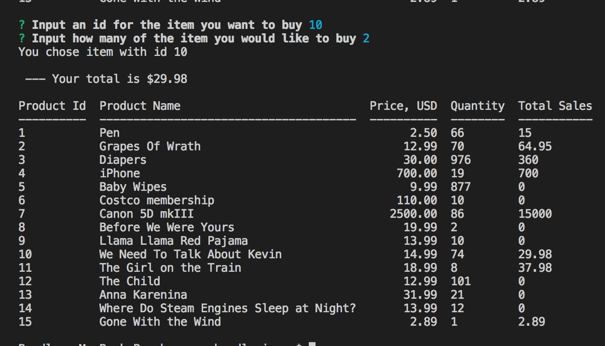

# Node.js & MySQL BAMAZON

## Overview
Bamazon app takes in orders from customers and depletes stock from the store's inventory. It also  tracks product sales across your store's departments and then provides a summary of the profits from all the departments. 

There are three JS files. One for customer interaction, one for managers and one for supervisors. 

## How to use
Fork this repo, in your terminal run ```npm i```

To use,  open any of the three files with node, and go through the prompts to choose what action you would like to complete.
 
 ## Screenshots 
 ______________________

 # CUSTOMER
{:height="50%" width="50%"}

# MANAGER
{:height="50%" width="50%"}
{:height="50%" width="50%"}
{:height="50%" width="50%"}
{:height="50%" width="50%"}

# SUPERVISOR
{:height="50%" width="50%"}
{:height="50%" width="50%"}